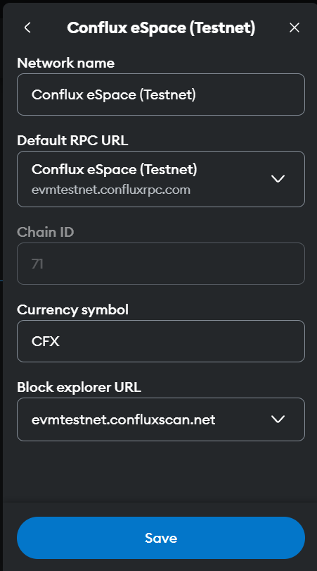

---

# ExpirableToken

`ExpirableToken` is an ERC20-compliant smart contract with added functionality for **expirable tokens**. Tokens minted through this contract can have an expiration time, after which they are automatically invalidated and burned.

## 🧾 Features

* ✅ Mint tokens with expiration time
* ✅ Track and remove expired tokens
* ✅ Transfer tokens while preserving their expiration
* ✅ Role-based access control (`owner` and `minter`)
* ✅ Batch-wise token storage for efficient expiration handling
* ✅ Reentrancy protection
* ✅ Burn expired tokens automatically

---

## ⚙️ Contract Details

* **Token Name**: Synergy coin
* **Symbol**: SGC
* **Decimals**: 0 (no fractions allowed)
* **Framework**: Solidity `^0.8.0`
* **Access Control**: Uses custom role management (`Roles.sol`)

---

## 📦 Structs

### `TokenBatch`

```solidity
struct TokenBatch {
    uint256 amount;
    uint256 expiration; // timestamp in seconds
}
```

Each token holder has an array of `TokenBatch`, with tokens tied to their expiration timestamps.

---

## 🛡 Roles

* `owner`: Can add/remove other owners and minters.
* `minter`: Can mint tokens.

---

## 🛠 Functions

### 🧑‍💼 Role Management

* `addOwners(address[] memory newOwners)`
* `removeOwners(address[] memory owners)`
* `addMinters(address[] memory newMinters)`
* `removeMinters(address[] memory minters)`

### 💸 Token Operations

* `mint(address to, uint256 amount, uint256 expiration)`
  Mints new tokens with a specific expiration (in seconds from now).

* `balanceOf(address account)`
  Returns the balance of **non-expired** tokens only.

* `transfer(address recipient, uint256 amount)`
  Transfers tokens, preserving the expiration of the source tokens.

* `transferFrom(address sender, address recipient, uint256 amount)`
  Same as `transfer`, with allowance checks (standard ERC20 behavior).

* `flushExpired(address account)`
  Burns and removes expired tokens for the specified user.

### 🧪 Internal & Helper

* `_updateExpiredTokens(address account)`
* `_reduceBalance(address account, uint256 amount, uint idx)`
* `getEarliestEpoch(address account, uint256 amount)`
* `_availableBalance(address account)`
* `isExpired(address account)`
  Returns all active (not yet expired) batches.

---

## 📢 Events

* `TokensMinted(address to, uint amount, uint expiration)`
* `TokensBurned(address account, uint amount)`
* `TokensTransferred(address from, address to, uint amount, uint expiration)`
* `MinterAdded(address by, address[] minterAddress)`
* `OwnerAdded(address by, address[] ownerAddress)`
* `BalanceUpdated(address user, uint newAmount)`
* `TokensExpired(address user, uint amount)`

---

## 🛑 Important Notes

* Expired tokens are automatically burned upon update/check.
* `transfer()` and `transferFrom()` will only succeed if the **first unexpired batch** has enough tokens.
* Make sure to flush expired tokens regularly using `flushExpired()` or by calling transfer functions.

---

## 🧱 Dependencies

* [OpenZeppelin Contracts](https://github.com/OpenZeppelin/openzeppelin-contracts):

  * `ERC20`
  * `ReentrancyGuard`
  * `Roles` (deprecated in newer OZ versions; consider updating or replacing)

---

## 📜 License

This project is licensed under the [MIT License](LICENSE).

---


use following RPC:
network name:
Conflux eSpace (Testnet)


token address: 0x6e107A31be0f14398731CB0486D7f0F1F9838F5A
